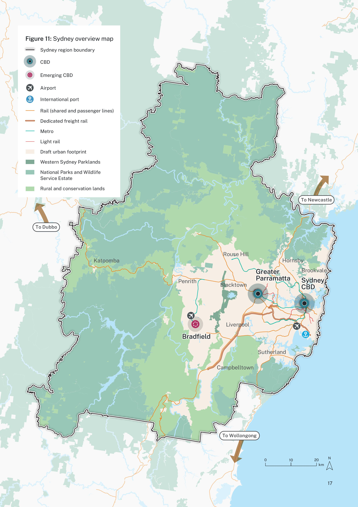

# Oceania-Australis Map Style

## Proposed Styles

- Standard  
  - Typical POIs
  - Include features of all other styles below to a varying degree.
- Topographic  
  - LIDAR hillshade  
  - Walking track visibility (de-emphasise invisible tracks)  
  - Track difficulty (SAC Scale)  
  - Handling for Aus specific things like State Forests  
  - Hiking routes  
  - Camping (Campsite, Water stations) and Bike (Parking, Repair) facilities  
  - Show dry lakes & intermittent water much lighter / less visible than Carto  
- Roads  
  - Bus Lanes, busways, Traffic Signs  
  - “School Zones” / Conditional speed limits  
  - Overtaking lanes at high zoom  
  - Rest areas / parking & emergency bays at high zoom  
- Public Transport  
  - PT Lines colourised  
  - Station/Tram Stops prioritised at lower zoom levels than typical  
  - Busways/T-ways  
  - Transit Group area (Bus Stands and Trains stations all together etc.)  
- Emergency  
  - Fire Stations, Police Stations, Ambulance Stations  
  - Bushfire Neighbourhood Safe Places  
  - SES depots, Marine Rescue bases  
  - Emphasis on rural fire support \- emergency=water\_tank, water=reservoir, fire trails (but no specific tagging for these from what I can see)  
  - Lifeguard towers, SLS Clubs  
  - Hospital & Emergency render differently
  - River gauges  
- Infrastructure  
  - Power Lines, Water/Sewage Pumping Stations, Cell Towers, Street lamps at high ZL  
  - Post boxes  
  - Weather radar stations and weather stations  
- Common POIs  
  - Government offices/services  
    - ServiceNSW, centrelink, recycling centres  
  - Branded icons for Supermarkets, petrol stations, department stores, hardware stores, common fast food, public phones  
  - Animal shelters (RSPCA and council depots)  
  - Operator-specific Transport iconography (“T” for Trains in Sydney, etc.)  
  - RSL Clubs  
  - Marae icon [OSM Wiki: amenity=marae](https://wiki.openstreetmap.org/wiki/Tag:amenity%3Dmarae)  
  - Flags?  
- Accessibility
  - Wheelchair icon for disabled parking spots and toilets

## Style Features

- Labels  
  - Font?  
  - Labels rendered separately  
- Colours  
  - Features  
    - Roads \*a,b  
      - Motorway (+ motorway\_link)  
      - Trunk (+ trunk\_link)  
      - Primary (+ primary\_link)  
      - Secondary (+ secondary\_link)  
      - Tertiary (+ tertiary\_link)  
      - Residential/Unclassified  
      - Service  
    - Transit  
    - Landuse \*1  
      - Hotel/motel/tourism campus landuse (render similar to retail or commercial)  
      - Childcare centre campus landuse (render similar to education)  
      - natural=shrubbery and Garden \- perhaps a flower pattern similar to landuse=flowerbed rather than the current dot halftone thing in carto
    - POIs  
  - Vivid style (OSM Carto)  
  - High Contrast (thicker outlines, solid colours)  
  - Muted/Low Contrast (Positron/Dark Matter)  
  - Colour-blind style/mode (increased usage of symbols and patterns to distinguish lines/ways/features) ***This should be default***

## Research

Road Hierachy Colours

| Road Type | NSW Raster Style (Old) | NSW Vector Style (New) | VIC Emergency Map |
| ---       | ---                    | ---                    | ---               |
| Motorway  | Orange                 | Red                    | Blue (Toll) / Green (Free) |
| Trunk     | Yellow                 | Deep Orange            | Red (Outline)     |
| Primary   | Orange                 | Orange                 | Red (Solid)       |
| Secondary | Orange                 |                        |                   |
| Other     | White                  | White                  |                   |

## Attachments

### 1. NSW SIX Maps - road hierarchy colours

| New style, vector topo (motorway=red, trunk=deep orange, primary=orange, secondary=yellow, other=white) | Old style, raster topo (motorway=orange, trunk=yellow, primary= orange, secondary=orange, other=white) |
| :--- | :--- |
|  |  |
|  | |

### 2. VIC Emergency Map - road hierarchy colours

| ![][image3] ![][image4] (motorway=blue (toll)/green (free), trunk=red (outline), primary=red (solid)) |
| :---- |

### 3. Sydney Plan

|  |
| :---- |
|  |
|  |
|  |
|  |
